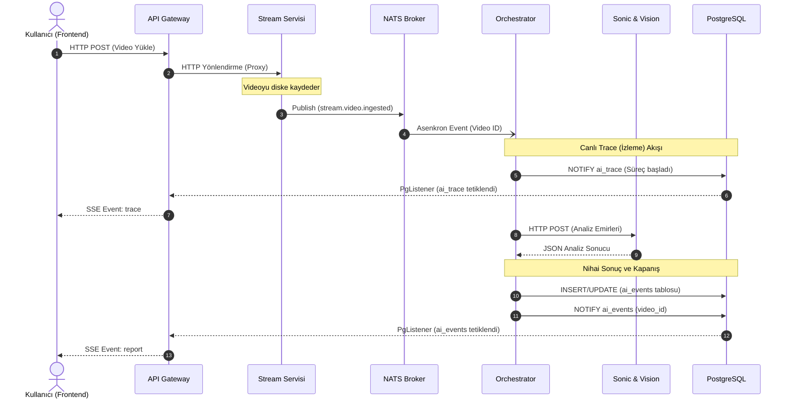
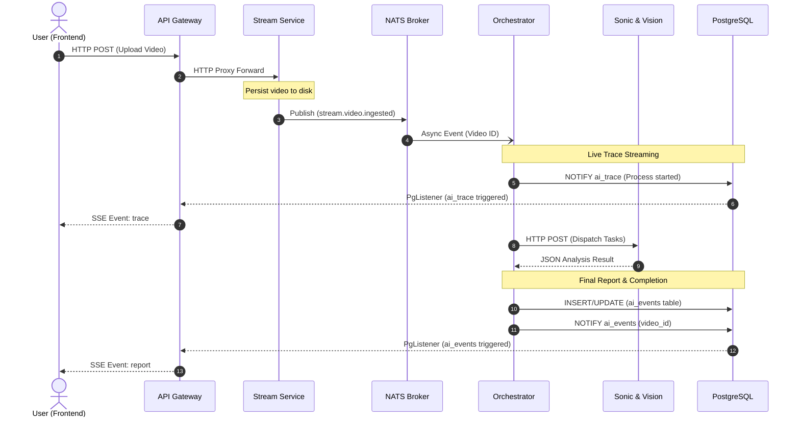

# Agentic Macro Loop Architecture / Ajan Makro Döngü Mimarisi

Bu doküman, Motif projesindeki asenkron olay güdümlü (event-driven) yapay zeka ajan mimarisinin baştan sona nasıl çalıştığını açıklamaktadır.
This document explains how the asynchronous event-driven AI agent architecture operates end-to-end in the Motif project.

---

## 🇹🇷 Türkçe (Turkish)

### 1. Sistemin Genel Bakışı

"Agentic Macro Loop" (Ajan Makro Döngüsü), sisteme yüklenen bir videonun mikroservisler arasında senkron bir bekleme olmadan, olay (event) tabanlı tetikleyicilerle işlenip sonuçların anlık olarak kullanıcıya ulaştırıldığı süreçtir. Sistem şu temel adımlardan oluşur:

1. **İçeri Alım (Ingestion):** Kullanıcı videoyu Gateway üzerinden yükler, Gateway bunu sadece bir ters vekil (reverse proxy) olarak Stream servisine HTTP üzerinden aktarır. Ağır veri yükü (video) NATS'ı meşgul etmez.
2. **Tetikleme (Triggering):** Stream servisi dosyayı kaydettikten sonra NATS üzerine ufak bir `stream.video.ingested` mesajı bırakır.
3. **Orkestrasyon:** NATS'ı dinleyen Orchestrator uyanır. Otonom yapay zeka ajanlarına (Sonic ve Vision) sırayla HTTP üzerinden analiz emirleri gönderir. Aynı zamanda her aşamada PostgreSQL'e anlık `ai_trace` bildirimleri göndererek sürecin izlenebilirliğini sağlar.
4. **Kayıt ve Yayın (Storage & SSE):** Ajanlardan alınan analiz birleştirilir, PostgreSQL `ai_events` tablosuna UPSERT edilir. Ardından veritabanı seviyesinde `pg_notify` ateşlenir. Gateway bu veritabanı bildirimini (Notification) yakalar ve Server-Sent Events (SSE) ile Frontend'e anlık rapor olarak iletir.

### 2. Mimari İletişim Grafiği

Aşağıdaki grafik sistemdeki bileşenlerin birbirleriyle olan senkron ve asenkron iletişimini detaylandırmaktadır.

---

## 🇬🇧 English

### 1. System Overview

The "Agentic Macro Loop" represents the event-driven workflow where an uploaded video is processed asynchronously across microservices without blocking HTTP calls, streaming both intermediate traces and the final AI report back to the user in real time. The core steps are:

1. **Ingestion:** The user uploads a video via the Gateway, which acts purely as a reverse proxy, forwarding the heavy HTTP payload directly to the Stream service. This keeps heavy loads off the message broker.
2. **Triggering:** Once the Stream service persists the file, it publishes a lightweight `stream.video.ingested` event to NATS.
3. **Orchestration:** The Orchestrator, listening to NATS, wakes up and sequentially dispatches analysis commands to the autonomous AI agents (Sonic and Vision) via HTTP. Throughout its execution, it sends live progress updates via PostgreSQL `ai_trace` notifications.
4. **Storage & Streaming (SSE):** The Orchestrator aggregates the agents' responses and UPSERTs the final report into the PostgreSQL `ai_events` table. It then fires a `pg_notify` trigger. The Gateway captures this database notification and streams the final JSON payload down to the Frontend via Server-Sent Events (SSE).

### 2. Architecture Communication Diagram

The following sequence diagram details the synchronous and asynchronous communication flows between the system components.

