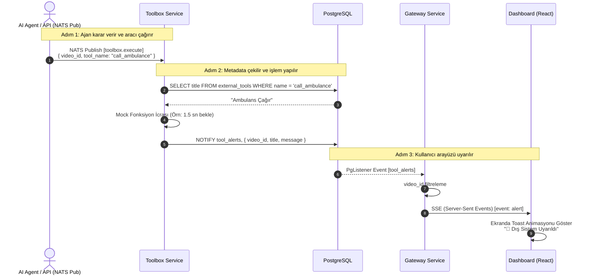
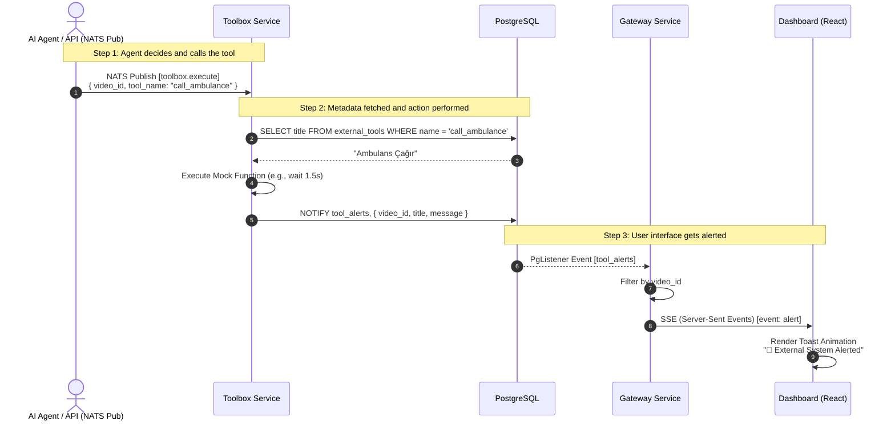

# MotifAI Toolbox Servisi ve Dış Araçlar Mimarisi / Toolbox Service & External Tools Architecture

## 🇹🇷 Türkçe (Turkish)

Bu doküman, MotifAI otonom ajanlarının fiziksel dünya ile etkileşime girmesini (örn. ambulans çağırma, kapıları kilitleme, polise haber verme) sağlayan **Toolbox** mikroservisinin ve uçtan uca bildirim mekanizmasının mimarisini açıklar.

### Mimari Özeti

Sistem, yapay zeka ajanlarının aldıkları kararları birer "Tool" (Araç) çağrısı olarak NATS üzerinden fırlatması ve `toolbox` servisinin bu işlemi icra edip kullanıcı arayüzünü (Dashboard) gerçek zamanlı olarak haberdar etmesi üzerine kuruludur.

1. **Veritabanı Katmanı (PostgreSQL):** Araçların (tools) listesi, başlıkları ve açıklamaları `external_tools` tablosunda tutulur. Bu sayede LLM prompt'larına sistemdeki yetenekler dinamik olarak enjekte edilebilir.
2. **Mesajlaşma (NATS):** Ajan veya dış bir tetikleyici, `toolbox.execute` konusuna (subject) içerisinde `video_id`, `tool_name` ve parametrelerin olduğu bir JSON yükü (payload) yollar.
3. **İcra (Toolbox Servisi):** NATS'ı dinleyen Rust tabanlı saf bir worker olan `toolbox` servisi bu isteği alır, mock işlemi çalıştırır (bekleme süresi simüle eder) ve PostgreSQL üzerinden `tool_alerts` kanalına bir `NOTIFY` fırlatır.
4. **Dağıtım (Gateway SSE):** Gateway servisi aktif olarak PostgreSQL'in `ai_events`, `ai_trace` ve `tool_alerts` kanallarını dinler. Gelen tool uyarısını yakalar ve Server-Sent Events (SSE) üzerinden frontend'e `event: alert` olarak yayınlar.
5. **Görselleştirme (Dashboard):** İlgili `video_id`'nin detay ekranını izleyen kullanıcı, Gateway'den gelen bu alert olayını yakalar ve ekranda (sağ alt köşe) dikkat çekici bir "Toast Notification" görür.

### İletişim Grafiği (Sequence Diagram)

---

## 🇬🇧 English

This document explains the architecture of the **Toolbox** microservice and the end-to-end notification mechanism that allows MotifAI autonomous agents to interact with the physical world (e.g., calling an ambulance, locking doors, notifying the police).

### Architecture Summary

The system is built upon AI agents broadcasting their decisions as "Tool" calls over NATS, and the `toolbox` service executing this action and alerting the user interface (Dashboard) in real-time.

1. **Database Layer (PostgreSQL):** The list of available tools, their titles, and descriptions are stored in the `external_tools` table. This allows the system's capabilities to be dynamically injected into LLM prompts.
2. **Messaging (NATS):** An agent or an external trigger sends a JSON payload containing the `video_id`, `tool_name`, and parameters to the `toolbox.execute` subject.
3. **Execution (Toolbox Service):** The Rust-based `toolbox` service, which acts as a pure NATS worker, receives this request, executes the mock process (simulating wait time), and fires a `NOTIFY` command to the `tool_alerts` channel via PostgreSQL.
4. **Distribution (Gateway SSE):** The Gateway service actively listens to PostgreSQL's `ai_events`, `ai_trace`, and `tool_alerts` channels. It catches the incoming tool alert and streams it to the frontend via Server-Sent Events (SSE) as `event: alert`.
5. **Visualization (Dashboard):** The user watching the details screen for the respective `video_id` catches this alert event from the Gateway and sees a prominent "Toast Notification" on the screen (bottom right corner).

### Interaction Diagram (Sequence Diagram)

