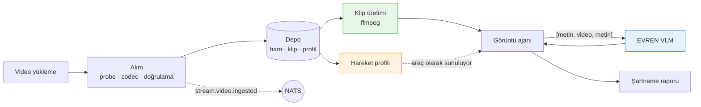

# Stream tarafı — ne yaptık, ne ölçtük

MotifAI · TEKNOFEST 2026 Yapay Zekâ Dil Ajanları Yarışması, 3. Senaryo

Bu belge sunum için hazırlandı: `apps/stream` ve `packages/optics` tarafında
yapılan işin tamamını, **ölçülmüş sayılarla** anlatıyor. Ayrıntılı tasarım
kararları ve faz planları için [07](../architecture/07-stream-phase-plan.md) ve
[08](../architecture/08-stream-adaptif-plan.md); ham ölçümler
`documents/measurements/` altında.

Belgedeki her sayı ölçülmüştür. Ölçülmemiş olanlar açıkça öyle yazılmıştır.

---

## 1. Problem

Şartname bir video dosyası alıp iş sağlığı ve güvenliği olaylarını
raporlamayı istiyor. Basit görünen bu işin altında iki sert kısıt var:

**Çıkarım servisi kare kümesi kabul etmiyor.** Ölçüldü: `vlm` modeline görüntü
gönderildiğinde `At most 0 image(s) may be provided` ile HTTP 400 dönüyor.
Zamansal içeriğin tek teslim biçimi **video klip**.

**Servisin sabit bir örnekleme hızı var.** 2,0 fps, en fazla 520 kare, teknik
tavan 260 saniye. Üstelik kodlayıcının piksel bütçesi tüm video için tek bir
toplam — kare başına değil. Yani video uzadıkça çözünürlük düşüyor.

Buradan çıkan tasarım sorusu şu: **elimizdeki dar bütçeyi videonun neresine
harcayacağız?**

---

## 2. Mimari



`apps/stream` yaklaşık 2.200 satır, `packages/optics` yaklaşık 2.900 satır.
Üçü birlikte (stream + optics + vision) **116 test** taşıyor.

---

## 3. Alım — sessiz başarısızlıkları erken yakalamak

Video yüklendiğinde üç kapı var ve üçü de ölçülmüş bir arızadan doğdu.

**Codec normalizasyonu.** Çıkarım servisinin çözücüsü AV1 açamıyor: ölçüldü,
tek kare bile çıkaramayıp HTTP 400 döndü. Aynı video H.264'e çevrilince
çalıştı. Final test videolarının kodlaması bilinmediği için bu adım alımda
zorunlu — sonraki her aşama güvenli codec'le çalışıyor.

**Durağan görüntü savunması.** `ffprobe` bir JPEG'i tek karelik video gibi
okuyor ve boru hattı sessizce anlamsız bir profil üretiyordu. Süre 200 ms'nin
altındaysa dosya reddediliyor: yanlış dosya yüklendiğinde hata almak, boş
sonuç almaktan iyi.

**Ölçülen metadata.** Klibin süresi hesaplanan değil, üretildikten sonra
`ffprobe` ile **ölçülen** değer. Arama hassasiyeti yüzünden birkaç kare kayma
oluyor ve bu kayma zaman çevirisine giriyor.

---

## 4. Adaptif örnekleme — projenin fikir merkezi

Sabit aralıklı örnekleme, olayın olduğu anı kaçırabilir. Hareket profili
videonun neresinde ne olduğunu çıkarıp kare bütçesini oraya kaydırıyor.

**Ölçüldü** (`01-stream-benchmark.md`, sentetik küme, kesin ground truth):

| ölçüt | sonuç |
|---|---|
| Event coverage recall | **24/24 — %100** |
| Ortalama kare azaltma | **78×** (uzun videolarda 200×+) |
| Zaman damgası sapması | 35 ms |

Adaptifliğin gerçekten katkı sağladığı da ölçüldü. `α` düzgün dağılımın
ağırlığı; 1,0 saf düzgün örnekleme demek:

| α | Recall | Ortalama sapma |
|---|---|---|
| 0,25 (bizim ayar) | **%100** | 54 ms |
| 1,0 (saf düzgün) | **%88** | 272 ms |

Yani adaptif seçim, eşit kare bütçesinde sabit örneklemeyi **12 puan** yeniyor
ve zamansal hassasiyeti beş kat artırıyor.

> **Dürüstlük notu.** Bu ölçüm *kare seçme* yolunda yapıldı. Çıkarım servisi
> kare kümesi kabul etmediği için teslim biçimi klibe döndü ve hareket profili
> bugün üretim akışında **kullanılmıyor**. Kod, testler ve ölçüm duruyor;
> devreye alınması ölçülmüş bir fayda beklemekte (bkz. §8).

---

## 5. Klip üretimi ve zamansal yakınlaştırma

Servis sabit 2 fps örneklediği için dar bir pencere göndermek tek başına
çözünürlüğü artırmıyor: 2 saniyelik klipten yine 4 kare çıkar.

Çözüm **ağır çekim**: aralık yavaşlatılırsa servis daha çok kare örnekliyor.
3 saniyelik pencereden 48 kare istemek 8× yavaşlatma demek ve orijinalde
16 fps'e karşılık geliyor.

Ölçüldü:

| aralık | istenen kare | uygulanan ölçek | klip süresi | çıkan kare |
|---|---|---|---|---|
| 3 sn | 24 | 4,0× | 11.967 ms | 24 |
| 2 sn | 40 | 10,0× | 19.967 ms | 40 |
| 10 sn | 20 | 1,0× | 10.000 ms | 20 |

**Zaman çevirisi burada kritik.** Model klibin kendi saatini raporluyor:
12–15 sn aralığı 8× yavaşlatılınca olayları `00:20–00:22` diye verdi ve
dönüşüm formülü isteme açıkça yazılmasına rağmen düzelmedi. Bu yüzden çeviri
modele bırakılmıyor, kodda yapılıyor (`ClipRef::to_source_ms`).

---

## 6. Ajan araçları

Stream, ajana yedi araç sunuyor. Hepsi canlı sistemde tek tek çağrılıp
doğrulandı:

| araç | iş |
|---|---|
| `video_info` | süre, çözünürlük, codec |
| `clip_range` | bir aralığın gerçek zamanlı klibi |
| `zoom_range` | bir aralığın ağır çekim klibi |
| `motion_profile` | kovalanmış hareket profili |
| `sample_overview` | kaba tarama kareleri |
| `get_frame` | tek kare |
| `crop_region` | karenin bir bölgesi |

Yakınlaştırma bütçesi video başına sınırlı (8) ve gerçekten uygulanıyor:
dokuzuncu çağrı `429 zoom_limit_exceeded` alıyor.

**Üretimde bunların üçü kullanılıyor**: `video_info`, `clip_range`,
`zoom_range`. Diğer dördü panel ve ölçüm içindir.

---

## 7. Uzun videolar — en son çözülen problem

Şartname video uzunluğuna sınır koymuyor. 10 dakikalık bir kayıt geldiğinde ne
oluyordu, ölçtük:

```
HTTP 502 — {"code":"vlm_unavailable",
            "error":"çıkarım servisi 413 döndü: Request Entity Too Large"}
```

**Kırpılmıyor, bozulmuyor — tamamen reddediliyor.** Ve ilk çarpılan duvar kare
sayısı değil, istek boyutu:

| klip | dosya | base64 yük | sonuç |
|---|---|---|---|
| 60 sn | 29,5 MB | 39,3 MB | ✅ |
| 180 sn | 88,4 MB | 117,9 MB | ✅ |
| 250 sn | ~123 MB | ~164 MB | ✅ |
| **600 sn** | 295,0 MB | **393,3 MB** | ❌ 413 |

### Çözüm: örtüşmeli parçalama

Servise sığmayan kayıt parçalara bölünüyor, her parça normal ajan döngüsünden
geçiyor, raporlar tek şartname raporunda birleşiyor. Parçalar 10 saniye
örtüşüyor ki sınıra denk gelen olay kesiğin ortasında kaybolmasın.

**Parça boyu ölçüldü** — 10 dakikalık gerçek kayıt, 13 etiketli olay, üç
tekrar, iki boy aynı koşuda:

| parça boyu | yakalanan | koşular | süre |
|---|---|---|---|
| 260 sn (servis tavanı) | 3,0/13 — %23 | 3, 3, 3 | 98 sn |
| **120 sn** | **10,0/13 — %77** | 10, 8, 12 | 154 sn |

Fark **+7 olay**, ölçüm gürültüsü bandı 4. Bant açık ara aşılıyor.

Sebep rehberle örtüşüyor: piksel bütçesi tüm video için tek bir toplam olduğu
için parça uzadıkça çözünürlük düşüyor (720p 77 sn üstünde, 540p 134 sn
üstünde küçülmeye başlıyor). 260 saniyelik parçada model bulanık görüyor.

Bedeli dürüstçe: iki katı çıkarım çağrısı, %57 daha uzun süre. Kapsama üç
katına çıktığı için ödeniyor.

### Zaman çevirisinin kanıtı

Test kaydı, 44,8 saniyelik gerçek bir servis kazası görüntüsünün tekrarı.
Parçalanmış analizde olaylar **tam 44,8 saniyelik periyotla** dizildi:
`00:20 → 01:05 → 01:50 → 02:35 → 03:20 → 04:05`. Parçalar arası kayma olsaydı
bu periyot bozulurdu.

### Sonuç

| | önce | sonra |
|---|---|---|
| 10 dakikalık kayıt | **413, rapor yok** | **200, 28 olay** |
| kapsama | — | 00:20 – 08:50 |
| ≤260 sn kayıtlar | — | **değişmedi** |

---

## 8. Ölçüp reddettiklerimiz

Sunumda anlatmaya değer: iki fikri **uygulamadan önce ölçtük ve eledik**.

**Hareket profilini modele ipucu vermek.** Uzun kayıtlarda hareketin yoğun
olduğu anları modele söylemeyi denedik. Sonuç **+0,0 olay** — gürültü bandının
içinde. Bedeli ise kesin: çözümleme **%51 yavaşladı**. Geri alındı.

Buradan çıkan bilgi değerliydi: ipucunun gösterdiği anlar ground truth ile
karşılaştırıldığında **doğru** çıktı (01:10 ve 00:25, 01:26 — profil her iki
olayı da bulmuştu). Yani modele nereye bakacağı söylendi ve yine de olayı
bulamadı. **Darboğaz örnekleme değil, semantik tanıma.**

**Yanlış alarmı azaltmak.** Olaysız kayıtta model 7–9 olay uyduruyordu. Bir
prompt varyantı bunu **0'a** indirdi — ama recall 14,3'ten 1,3'e çöktü.
Reddedildi.

Her ikisi de aynı duvara çarptı: sentetik ölçüm kümesi *örneklemeyi* ölçüyor,
*anlamayı* değil. Bu tür iyileştirmeler gerçek İSG videolarından etiketli bir
küme olmadan ölçülemez.

---

## 9. Ölçüm altyapısı

Bu projede bir kural var: **ölçülmeyen değişiklik yapılmıyor.**

`bench prompts` ajanın tamamını koşturuyor — klip gerçekten `stream`'den
geliyor, istek gerçekten çıkarım servisine gidiyor. Sağladıkları:

- **Tekrarlı koşum** (`--tekrar N`) ve **gürültü bandı**. İki varyant
  arasındaki fark bandı aşmıyorsa çıktı `ANLAMLI DEĞİL` yazıyor.
- **Video kararlılığı** ayrımı: hangi videolar koşular arası sabit, hangileri
  savruluyor.
- **Yanlış alarm** ölçümü: ground truth'u sıfır olan kayıtlar ayrı raporlanıyor.
- Commit'lenebilir markdown raporu (`--rapor`).

Bu altyapı kendi hatasını da buldu: harness videoyu koşular arasında yeniden
kullanıyordu ve yakınlaştırma bütçesi birikiyordu, yani **sırayla ölçülen
ikinci varyant haksız yere kötü görünüyordu**. Düzeltilmeseydi bir sonraki
karşılaştırma yanlış çıkardı.

Öğrenilen bir başka şey: gürültü bandı **oturumlar arasında değişiyor**. Aynı
kod ve küme, bir ölçümde yayılım 1, diğerinde 5 çıktı. Bu yüzden karşılaştırma
her zaman **tek koşuda, yan yana** yapılıyor.

---

## 10. Bugünkü durum — dürüst tablo

### Çalışan ve ölçülmüş

| | |
|---|---|
| yedi ajan aracı | canlı doğrulandı |
| klip üretimi, ağır çekim, kare bütçesi | ölçüldü, tam tutuyor |
| yakınlaştırma limiti | `429` ile uygulanıyor |
| codec normalizasyonu, durağan görüntü savunması | çalışıyor |
| uzun kayıt parçalama | 413 → 200, 28 olay |
| adaptif örnekleme | %100 recall, 78× azaltma |

### Bilinen sınırlar

**Hareket profili üretim akışında kullanılmıyor.** Teslim biçimi klibe
döndüğünde kare seçme yolu devre dışı kaldı. Kod ve ölçüm duruyor; ipucu
olarak vermenin faydası ölçüldü ve çıkmadı.

**`stream.frame.extracted` olayı hiç yayınlanmıyor.** Kare tabanlı yola bağlı;
klip mimarisine geçişte ortada kaldı. Tüketicisi yok.

**Bellek video uzunluğundan bağımsız değil, doğrusal.** Kare tamponu iki
kareyle sınırlı ama örnek vektörü ~5 KB/sn büyüyor: bir saatlik kayıt ≈ 18 MB
profil. Şartname videolarında sorun değil.

**Sahne kesme algılama neredeyse hiç tetiklenmiyor** — 19 profilde 9.065
örnekte 4 kesme. Sabit kameralı güvenlik kaydında kesme olmaması normal;
benchmark'taki kazancı 19 ms.

### Ölçülmemiş sorular

- 77 saniyelik parça 120'den daha mı iyi? (rehber orayı işaret ediyor)
- Servise sığan bir kaydı bölmek fayda getirir mi?
- Hareket ipucu **gerçek** İSG videolarında işe yarar mı?

Üçü de Golden Dataset (#5) geldiğinde ölçülebilir.

---

## 11. Sunumda öne çıkarılabilecek üç şey

**1. Ölçüm kültürü.** Dört fikirden ikisi tuttu, ikisi ölçülüp elendi. Her
kararın arkasında sayı var ve reddedilenler de belgeli. Şartname §4
katılımcının kendi metriklerini tanımlamasını ve raporlamasını istiyor — bu
belge ve `documents/measurements/` tam olarak bu.

**2. Adaptif örnekleme.** Eşit kare bütçesinde sabit örneklemeyi %88'e karşı
%100 ile yeniyor, 78× kare azaltma sağlıyor.

**3. Uzun video dayanıklılığı.** 10 dakikalık kayıt önce hiç rapor
üretmiyordu; şimdi tam kapsama ile üretiyor ve parça boyu ölçümle seçildi.
